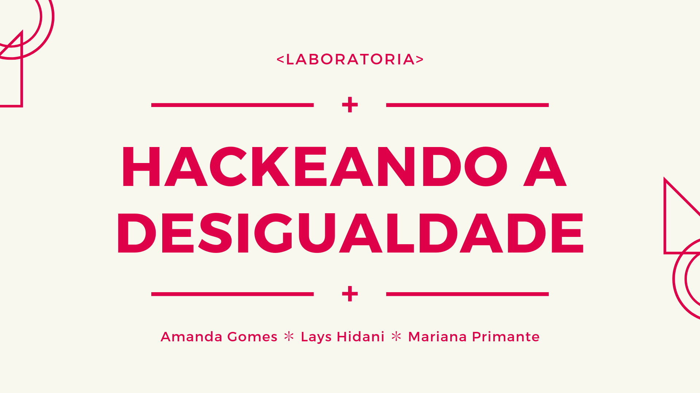
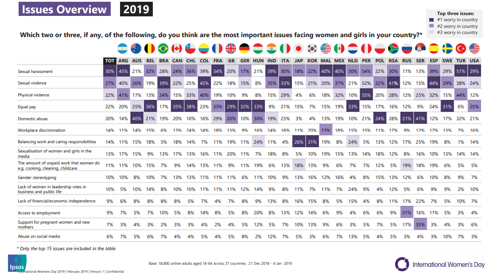
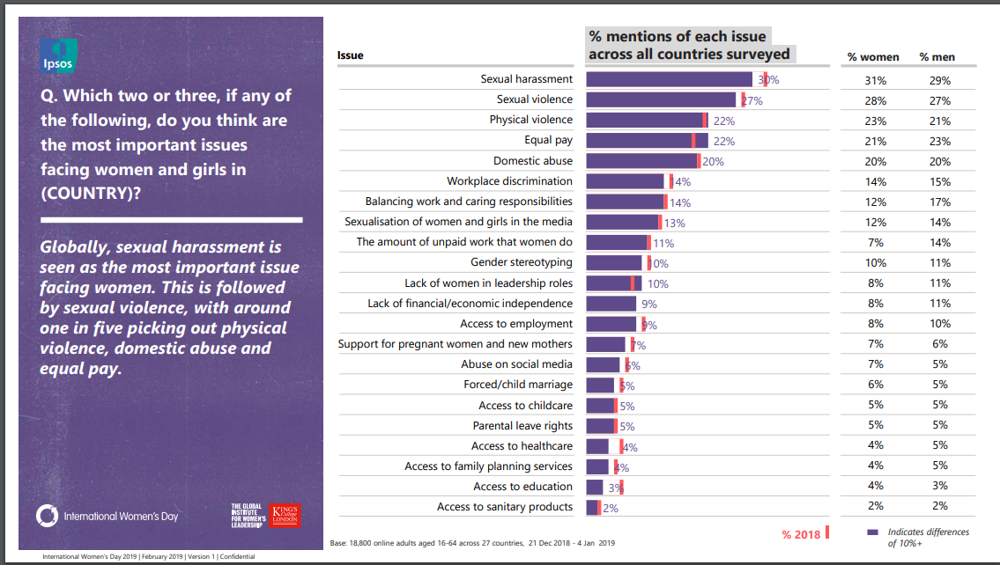
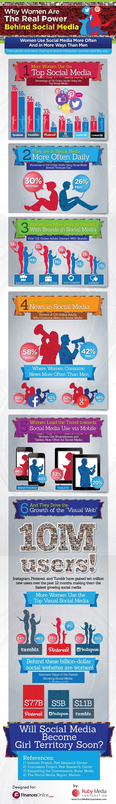
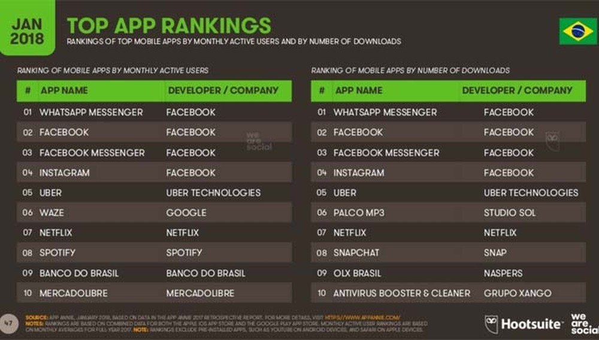
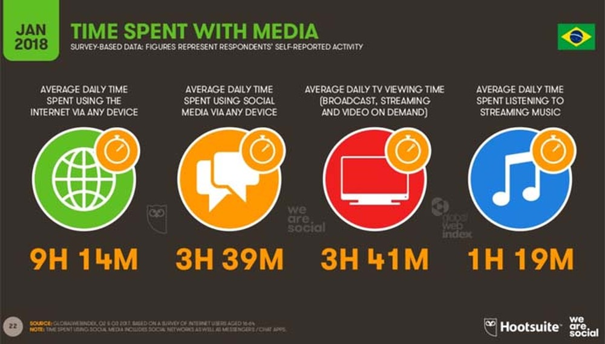
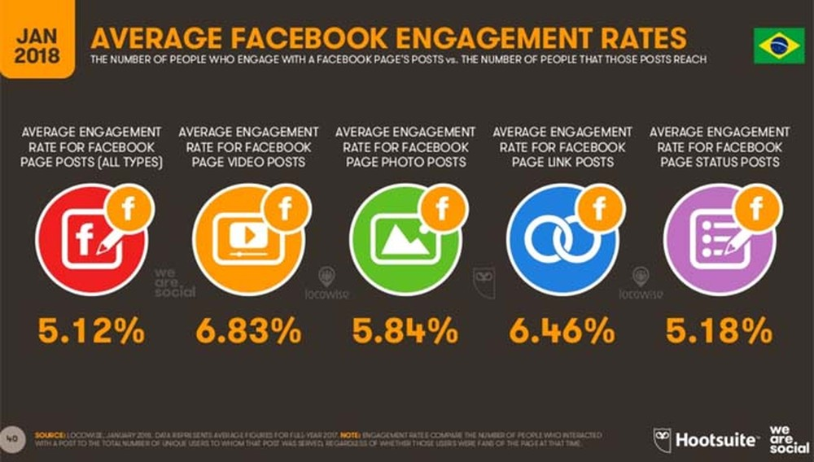
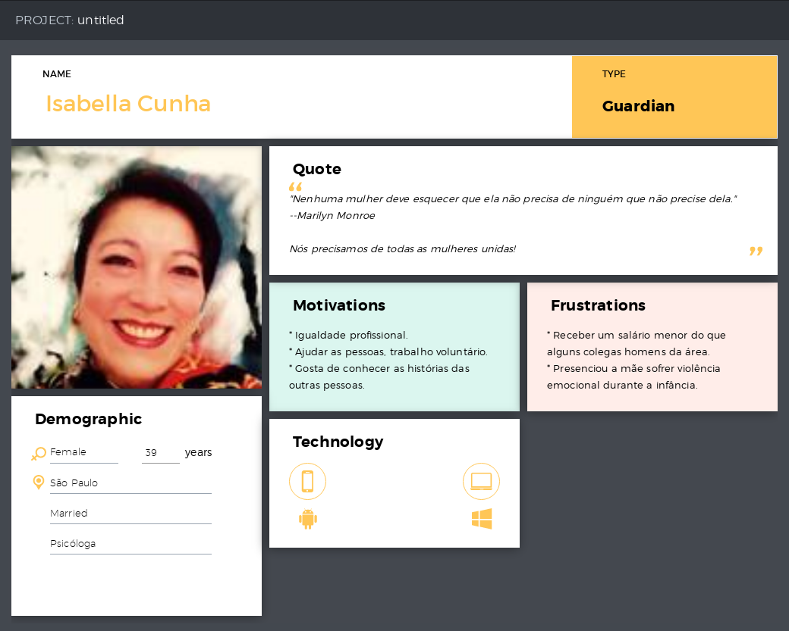
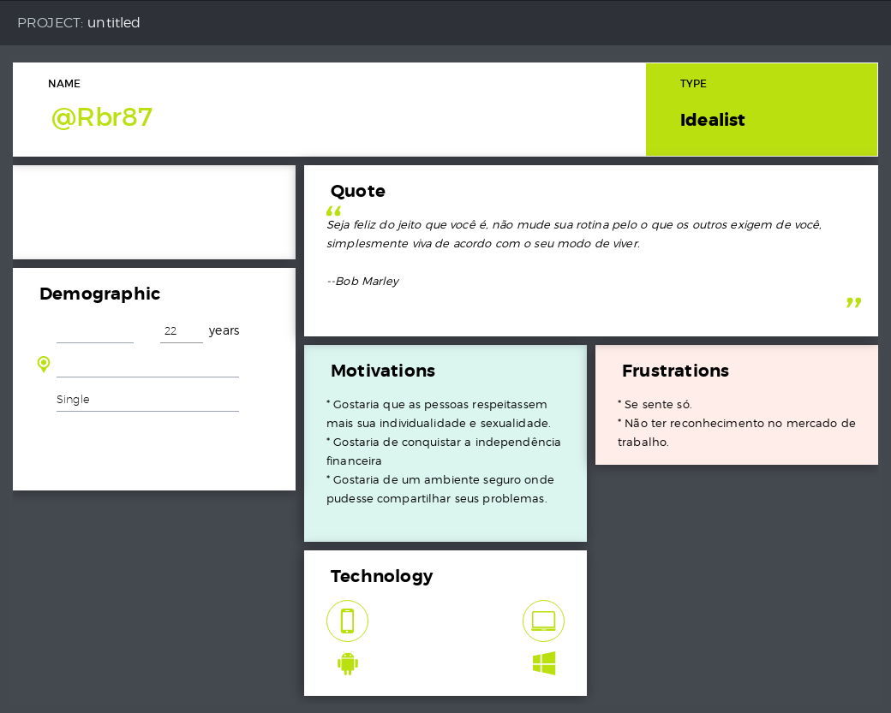
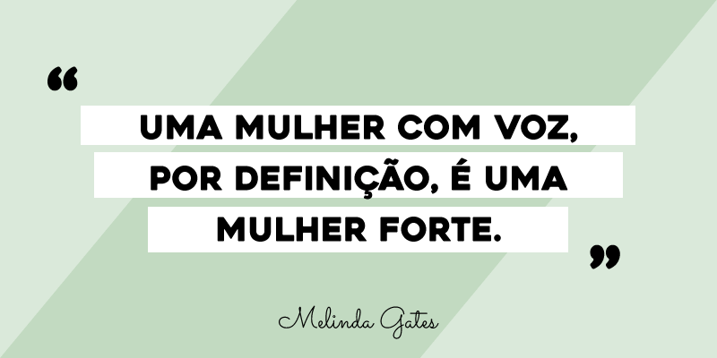

# Hackendo a desigualdade

***"Nenhuma mulher deve esquecer que ela não precisa de ninguém que não precise dela."*** --Marilyn Monroe

**Nós precisamos de todas as mulheres unidas!**

---

## Sumário
* [O Problema](#O-Problema)
* [Mulheres e as redes sociais](#Mulheres-e-as-redes-sociais)
  * [As mulheres dominam todas as mídias sociais](#As-mulheres-dominam-todas-as-mídias-sociais)
  * [As redes sociais mais usadas no Brasil](#As-redes-sociais-mais-usadas-no-Brasil)
  * [Tempo médio gasto com mídias](#Tempo-médio-gasto-com-mídias)
  * [Taxas médias de engajamento](#Taxas-médias-de-engajamento)
* [Solução](#Solução)
  * [Quem somos nós?](#Quem-somos-nós?)
* [Todo dia é dia de batom vermelho!](#Todo-dia-é-dia-de-batom-vermelho!)

## O Problema

Veja alguns dados de uma [pesquisa](https://www.ipsos.com/sites/default/files/ct/news/documents/2019-03/international-womens-day-2019-global-attitudes-towards-gender-equality.pdf) realizada pelo instituto [IPSOS](https://www.ipsos.com/en) para o Dia Internacional da Mulher de 2019:

**Visão geral dos problemas:**

**Menções sobre cada problema no mundo todo:**

> A violência sexual é o problema mais importante enfrentado pelas mulheres e meninas no Brasil, aponta a pesquisa global “International Women’s Day 2019 – Global atitudes towards gender equality” da Ipsos. Para 39% dos brasileiros, a violência sexual é a questão mais significativa, seguida por violência física (34%) e assédio sexual (28%). --[*Revista Algo Mais*](http://revista.algomais.com/exclusivas/pesquisa-violencia-sexual-e-fisica-sao-as-principais-preocupacoes-das-mulheres)

> A preocupação com a violência física cresceu 6 pontos percentuais em comparação com 2018, quando marcou 28%. O índice de violência sexual, no entanto, diminuiu; foram 8 pontos percentuais em relação a 2018 (47%). Já o assédio sexual registrou 38% no ano passado (uma queda de 10 p.p). --[*Revista Algo Mais*](http://revista.algomais.com/exclusivas/pesquisa-violencia-sexual-e-fisica-sao-as-principais-preocupacoes-das-mulheres)

> “No ano passado, tivemos um aumento considerável no número de feminicídio e tentativas de assassinatos de mulheres no Brasil. O país é hoje o quinto que mais mata mulheres do mundo. Estes casos estão sendo amplamente noticiados pela imprensa que coloca a questão em maior evidência, se tornando o cerne da preocupação das questões de equidade de gênero no país”, afirma Maiani Machado, diretora da área de reputação corporativa na Ipsos.
--[*Revista Algo Mais*](http://revista.algomais.com/exclusivas/pesquisa-violencia-sexual-e-fisica-sao-as-principais-preocupacoes-das-mulheres)

> No mundo, os maiores problemas listados são os mesmos do Brasil, mas a ordem é diferente. Assédio sexual lidera o ranking (30%), violência sexual está na segunda colocação (27%) e violência física e igualdade salarial ficaram em terceiro lugar, com 22%.
> O quarto tema globalmente mais citado, também relacionado a violência, é o abuso doméstico, com 20%. O assunto também aparece em quarto lugar no Brasil, com 19%.
--[*Revista Algo Mais*](http://revista.algomais.com/exclusivas/pesquisa-violencia-sexual-e-fisica-sao-as-principais-preocupacoes-das-mulheres)

> Dados da nossa pesquisa apontam para uma sensação de impunidade por parte das mulheres, o que intensifica o medo, 61% das mulheres acredita que os relatos de assédio sexual são ignorados. Campanhas e manifestações crescentes na internet e na mídia, como ***#MeToo***, também tem contribuído para que o tema ganhe visibilidade.
--[*donna*](https://gauchazh.clicrbs.com.br/donna/noticia/2018/03/pesquisa-mostra-as-principais-preocupacoes-das-mulheres-em-27-paises-saiba-quais-sao-elas-cjpiitfvk0077qpcnd40raame.html)

## Mulheres e as redes sociais

Veja o infográfico abaixo:

### As mulheres dominam todas as mídias sociais

> “As mulheres são muito ativas nas redes sociais e se comunicam através delas com naturalidade porque compartilham uma lógica comunicativa muito similar. Por definição, são muito expressivas e se sentem confortáveis mantendo múltiplas conversas simultaneamente”, diz Gabriela Oliván, expert em Comunicação Corporativa. 
--[*connectamericas*](https://connectamericas.com/pt/content/mulheres-lideram-revolu%C3%A7%C3%A3o-das-redes-sociais-0)

> Na América Latina, uma pesquisa da Intel revelou que 33% das mulheres usa o Facebook como meio de comunicação com seus amigos e 8 de cada 10 prefere o uso das redes sociais para estar mais conectada com outras pessoas por meio do bate-papo.
--[*connectamericas*](https://connectamericas.com/pt/content/mulheres-lideram-revolu%C3%A7%C3%A3o-das-redes-sociais-0)

> Em caso do conteúdo gerado pelas diferentes marcas nas plataformas sociais, também é possível apreciar diferenças entre ambos gêneros. Enquanto as mulheres seguem as marcas para conhecer as novidades, ofertas e descontos, os homens só as seguem porque gostam ou se identificam com a marca, mas não estabelecem uma relação com a empresa seguida. Elas, em troca, geram feedback, opinam sobre seus produtos e participam nos concursos, entre outras coisas.
--[*connectamericas*](https://connectamericas.com/pt/content/mulheres-lideram-revolu%C3%A7%C3%A3o-das-redes-sociais-0)

Confira alguns dados do [We are social](https://wearesocial.com):

### As redes sociais mais usadas no Brasil:

### Tempo médio gasto com mídias:

Como vimos, nos dados acima, os serviços de troca de mensagens (whatsapp e messenger), lideram junto às redes sociais, tendo o Facebook como mais bem colocado.

Na imagem abaixo podemos conferir 

### Taxas médias de engajamento:

## Personas

Persona 1

Persona 2

## Solução

O **Batom Vermelho** é uma rede social voltada para todas as pessoas que se indentificam como mulheres, oferecendo um canal de incentivo a denúncias para qualquer tipo de violência e que traz informações sobre onde encontrar atendimento especializado para cada caso. 

O intuito principal é o empoderamento, pois com a união podemos construir um ambiente onde todas se sintam seguras e apoiadas para compartilhar informações, sentimentos e experiências de vida. Por isso, além do canal de compartilhamento de denúncias, o engajamento é promovido através de hashtags (#) sobre diversos temas, como:

* Autoestima
* Desabafos
* Profissão
* Cursos e oportunidades
* Igualdade de gênero

Para que as mulheres tenham ainda mais segurança, possibilita-se o uso de avatares no lugar de foto de perfil, e *username* no lugar do nome real.

### Tudo isso, porque acreditamos que a segurança emocional é a forma de vencer as barreiras da insegurança e da violência do dia-a-dia da mulher para que ela possa dar o próximo passo.

**Batom vermelho**: informação, apoio e empoderamento feminino em suas mãos:

Com o simples uso do batom, muitas vezes renegado por se ter medo ou vergonha em atrair muita atenção conseguimos trazer força para encararmos nosso dia-a-dia e com essa força nos unir com mulheres com o movimento #hojeédiadebatomvermelho mostrando que podemos fazer o que quisermos, na hora e no dia que quisermos sem ter medo, vergonha ou pensar em alguém antes de si mesma.

Protótipo de postagem:

xxx

### Quem somos nós?

Nós somos a desconhecida por quem você passou a caminho de casa, nós somos suas amigas, suas irmãs,suas mães... nós somos todas as mulheres.

Estamos aqui para apoiar e empoderar!

Alguma vez na vida você já se sentiu insegura de andar sozinha? 
Alguém já te disse que você não é capaz? 
Que tal profissão não é para você? 
Você já sofreu algum tipo de assédio?

Temos uma boa notícia, você não esta sozinha. Nós estamos com você!

Ás vezes, tudo o que precisamos para fazer brilhar toda nossa força de mulher são outras vozes para se unirem à nossa.

Na Batom Vermelho, você vai encontrar uma rede de mulheres como você, para que você se sinta mais segura para compartilhar suas ideias, medos, experiências, e opiniões, e assim se sentir mais confiante para dar o próximo passo.

## Todo dia é dia de batom vermelho!

Junte sua voz à nossa! Se inscreva agora mesmo: [**Batom vermelho**]().

